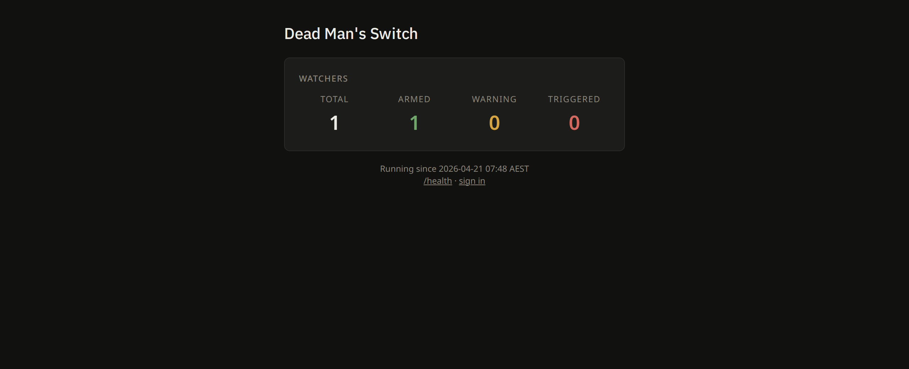
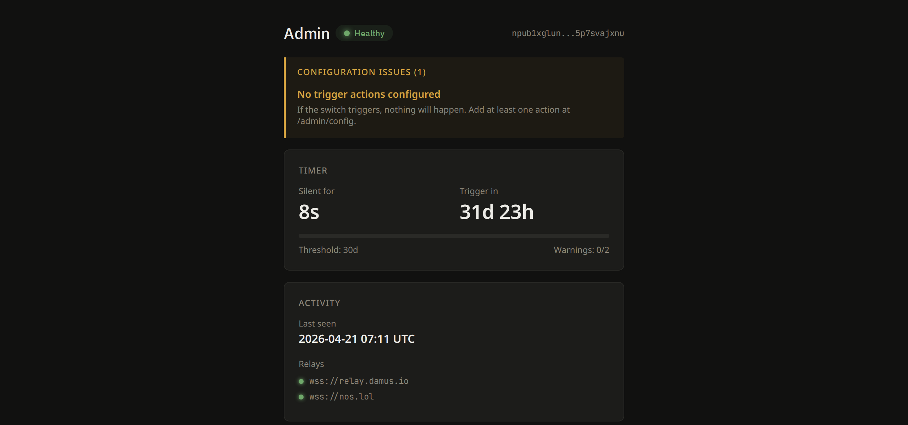
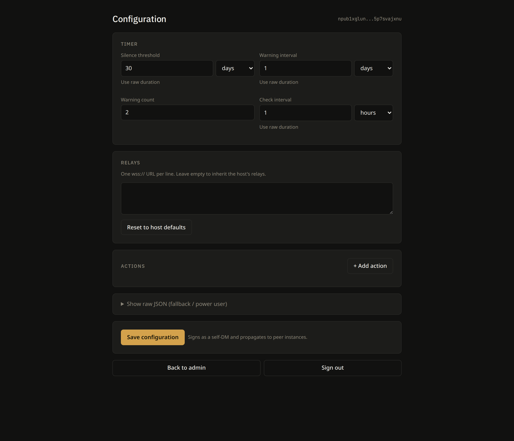
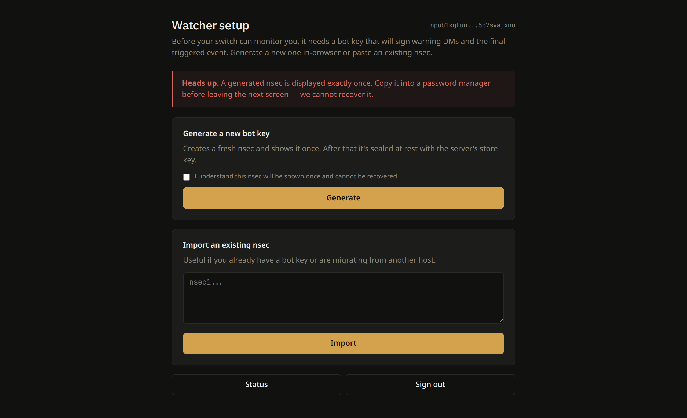

# nostr-dead-man-switch

A Nostr-native dead man's switch. Instead of manual check-ins, it passively monitors your npub across relays. Posts, reactions, zaps — any signed event resets the timer. Your normal Nostr usage is your proof of life.

If you go silent for X days, it sends you a private DM as a last-resort check-in. No response? It tries once more. Still nothing? It triggers — sends emails, publishes notes, hits webhooks, whatever you've configured.

## Status

Pre-1.0, no tagged releases yet. Config schema, CLI flags, and state file format may change between commits. If you run this, pin to a specific commit, keep backups of your `config.yaml` and state files, and re-read this README before pulling updates. Tagged releases and published container images are planned before the project is submitted to Umbrel / Start9 app stores.

## Why this over existing tools

Existing dead man's switches ([Aeterna](https://github.com/alpyxn/aeterna), [LastSignal](https://github.com/giovantenne/lastsignal)) require you to remember to check in on a schedule. That works until it doesn't — and the failure mode is *triggering when you're alive but forgot*.

This monitors your actual activity:

- **No check-in fatigue** — you don't have to remember to click a link or enter a code every month forever
- **Cryptographic proof** — events are signed with your key, not just "someone clicked an email link"
- **Stays inside Nostr** — monitoring and check-in DMs all happen on the protocol, only the final payload actions go outside
- **Dead simple to run** — it's a relay subscription, a timestamp, and a timer

## How it works

```
Monitor npub across relays
         │
    Any event? ──yes──→ Reset timer
         │
         no (silence threshold exceeded)
         │
    Send warning DM #1
         │
    Wait... any event? ──yes──→ Reset timer
         │
         no
         │
    Send warning DM #2
         │
    Wait... any event? ──yes──→ Reset timer
         │
         no
         │
    ┌─────────────┐
    │   TRIGGER    │
    │              │
    │  • emails    │
    │  • webhooks  │
    │  • notes     │
    └─────────────┘
```

## Quick start

### Docker (recommended)

```bash
# Clone
git clone https://github.com/AusDavo/nostr-dead-man-switch.git
cd nostr-dead-man-switch

# Generate a bot keypair
docker compose run --rm deadman --generate-key

# Set up secrets
cp .env.example .env
# Edit .env with the bot nsec you just generated (and SMTP password if using email)

# Set up config
cp config.example.yaml config.yaml
# Edit config.yaml with your npub, relays, timing, and actions

# Run
docker compose up -d

# Status page at http://localhost:8080
```

### Build from source

```bash
go build -o nostr-deadman .
./nostr-deadman -config config.yaml
```

## Configuration

See [config.example.yaml](config.example.yaml) for the full reference. Key settings:

| Setting | Default | Description |
|---------|---------|-------------|
| `watch_pubkey` | — | npub or hex pubkey to monitor |
| `bot_nsec` | — | Bot's private key for sending warning DMs |
| `relays` | — | Relay WebSocket URLs to monitor |
| `silence_threshold` | — | How long of silence before first warning (e.g. `30d`, `4w`, `720h`) |
| `warning_interval` | `24h` | Time between warning DMs |
| `warning_count` | `2` | Number of warning DMs before triggering |
| `check_interval` | `1h` | How often to evaluate the timer |
| `listen_addr` | — | Status page address (e.g. `:8080`). Empty = disabled |
| `state_file` | `state.json` | Where to persist state |
| `federation_v1` | auto | Multi-tenant mode. Defaults to `true` when `watch_pubkey` is empty; set to `false` explicitly to force legacy single-switch mode |
| `whitelist_file` | `<state_dir>/whitelist.json` | Federation only — enrolled npubs this deployment supervises |
| `state_dir` | `dir(state_file)` | Federation only — per-user state files live here |

Non-secret config (hosts, ports, addresses) goes directly in `config.yaml`. Only passwords, tokens, and webhook URLs go in `.env` (see [.env.example](.env.example)) and are referenced via `${VAR_NAME}`.

## Trigger actions

All actions are configured in `config.yaml` under `actions:`. Secrets (passwords, tokens, webhook URLs) go in `.env` and are referenced as `${VAR_NAME}`. See [config.example.yaml](config.example.yaml) for complete, ready-to-uncomment templates for every action type.

### Email (SMTP)

One action per recipient. Duplicate the block for each person (spouse, lawyer, executor, etc.).

```yaml
- type: email
  config:
    smtp_host: smtp.fastmail.com  # or smtp.gmail.com, etc.
    smtp_port: 587
    smtp_user: you@fastmail.com   # login username
    smtp_pass: "${SMTP_PASS}"     # app password — only secret, lives in .env
    from: you@yourdomain.com      # sending address (can differ from login)
    to: "spouse@example.com"
    subject: "Automated message from David"
    body: |
      Hi,

      This is an automated message. My Nostr account has been inactive
      for over 30 days, and I did not respond to two check-in attempts.

      This may mean I am incapacitated, unreachable, or worse.
      Please follow the instructions we discussed, or refer to the
      documents in [location].

      — Sent automatically by nostr-dead-man-switch
```

### ntfy push notification

```yaml
- type: webhook
  config:
    url: "${NTFY_URL}"            # https://ntfy.sh/your-topic or self-hosted
    method: "POST"
    headers:
      Title: "Dead Man's Switch Triggered"
      Priority: "5"
      Tags: "warning,skull"
    body: "No Nostr activity or DM response for 30+ days."
```

### Telegram bot

```yaml
- type: webhook
  config:
    url: "https://api.telegram.org/bot${TELEGRAM_BOT_TOKEN}/sendMessage"
    method: "POST"
    headers:
      Content-Type: "application/json"
    body: '{"chat_id":"${TELEGRAM_CHAT_ID}","text":"Dead mans switch triggered. No Nostr activity for 30+ days."}'
```

### Discord / Slack webhook

```yaml
# Discord
- type: webhook
  config:
    url: "${DISCORD_WEBHOOK_URL}"
    method: "POST"
    headers:
      Content-Type: "application/json"
    body: '{"content":"**Dead Mans Switch Triggered**\nNo Nostr activity for 30+ days."}'

# Slack
- type: webhook
  config:
    url: "${SLACK_WEBHOOK_URL}"
    method: "POST"
    headers:
      Content-Type: "application/json"
    body: '{"text":"*Dead Mans Switch Triggered*\nNo Nostr activity for 30+ days."}'
```

### Generic webhook

Works with n8n, Zapier, Make, Home Assistant, custom APIs, etc.

```yaml
- type: webhook
  config:
    url: "https://your-service.example.com/api/deadman"
    method: "POST"
    headers:
      Content-Type: "application/json"
      Authorization: "Bearer ${WEBHOOK_TOKEN}"
    body: '{"event":"triggered","source":"nostr-dead-man-switch"}'
```

### Nostr note (signed by bot)

```yaml
- type: nostr_note
  config:
    content: |
      This is an automated message from a dead man's switch.
      The owner of this bot has been inactive on Nostr for over 30 days
      and did not respond to private check-in messages.
    relays:
      - "wss://relay.damus.io"
      - "wss://nos.lol"
```

### Encrypted Nostr DM (signed by bot)

Sends a NIP-04 encrypted DM from the bot's npub to a single recipient. Only the recipient can read it.

```yaml
- type: nostr_dm
  config:
    to_npub: "npub1…"
    content: |
      If you're reading this, my dead man's switch has fired.
      Instructions are in the shared vault under [location].
    relays:                            # optional — inherits host list if blank
      - "wss://relay.damus.io"
      - "wss://nos.lol"
```

### Pre-signed Nostr event (from YOUR identity)

Sign an event with your own nsec ahead of time — the bot just publishes it. It appears as your post, not the bot's. The bot never sees your private key.

Create one with [nak](https://github.com/fiatjaf/nak) or any nostr signing tool:
```bash
echo '{"kind":1,"content":"If you are reading this, my dead mans switch has activated."}' | nak event --sec nsec1...
```

Then paste the full signed JSON:
```yaml
- type: nostr_event
  config:
    event_json: '{"id":"...","pubkey":"...","created_at":0,"kind":1,"tags":[],"content":"...","sig":"..."}'
    relays:
      - "wss://relay.damus.io"
      - "wss://nos.lol"
```

## Dashboard

Set `listen_addr: ":8080"` to enable the dashboard. Three surfaces:

**Public status page (`/`).** Aggregate view of watchers — total, armed, warning, triggered. Public and read-only; no per-user state is leaked.



**Per-user admin (`/admin`).** Signed-in landing page for an enrolled user. Shows health, silence/trigger timer, warning progress, last-seen timestamp, connected relays, and any configuration issues. Sign in at `/login` with a NIP-07 browser extension such as [Alby](https://getalby.com) or [nos2x](https://github.com/fiatjaf/nos2x). In legacy mode only the key set as `watch_pubkey` can sign in; in federation mode any enrolled whitelisted npub can.



**Per-user config (`/admin/config`).** Field-based form for editing your own timer, relays, and actions. Durations use a number + unit picker; each action card has a Test button that fires that single action live. Save publishes the new `UserConfig` as a self-DM and propagates to every peer in the federation.



Run `./nostr-deadman --reset-session` to rotate the session secret and invalidate all logins.

A `/health` JSON endpoint is also available for monitoring:

```json
{"status":"healthy","last_seen":"2026-04-11T12:00:00Z","silence_seconds":3600,"warnings_sent":0,"triggered":false}
```

## State and re-arming

State is persisted to a JSON file (default: `state.json`). To re-arm the switch after it triggers, delete the state file and restart.

The state file tracks:
- Last seen event timestamp
- Number of warnings sent
- Whether the switch has triggered

## Generate a bot key

In legacy single-user mode, use the CLI:

```bash
docker compose run --rm deadman --generate-key
```

Use a dedicated keypair for the bot. Do **not** use your main nsec.

In federation mode, enrolled users generate or import their watcher nsec from `/admin/watcher` in the browser. Generate prints the nsec exactly once (save it to a password manager); import accepts an existing nsec. Either path seals the key at rest with the host's `DEADMAN_WATCHER_KEY` before writing it to disk.



## Roadmap

- [x] ~~[Web dashboard for configuration editing](https://github.com/AusDavo/nostr-dead-man-switch/issues/1)~~ — shipped. Authenticated `/admin/config` form lets each user edit their own `UserConfig` and persists updates via self-DM propagation.
- [x] ~~[Multi-tenant "Uncle Jim" mode](https://github.com/AusDavo/nostr-dead-man-switch/issues/2)~~ — shipped as federation v1. One deployment supervises a whitelist of enrolled npubs, each with their own bot key, actions, and timing. See the section below.
- [**v0.1.0 release gate**](https://github.com/AusDavo/nostr-dead-man-switch/milestone/1) — CI, multi-arch GHCR image, versioned binary, CHANGELOG, schema versioning, and UI re-arm. Prerequisites for Umbrel / Start9 app store submission.
- Cross-peer fire coordination (federation v2) — staggered fire slots + receipts so multiple active peers don't double-send actions. v1 limitations described below.

## Federation v1

Federation mode turns one deployment into an "Uncle Jim" dead-man switch that
supervises a whitelist of enrolled npubs. Each enrolled user has their own
timing, relays, actions, and bot-key-wrapped `UserConfig` — but shares one
running process and one set of relay connections.

**Turning it on.** Leaving `watch_pubkey` empty flips `federation_v1: true`
automatically. Set `federation_v1: false` explicitly in `config.yaml` to force
the legacy single-switch mode regardless of `watch_pubkey`.

**Enrolling users.** Add npubs to the whitelist with the CLI:

```bash
./nostr-deadman --whitelist-add npub1...
./nostr-deadman --whitelist-list
./nostr-deadman --whitelist-remove npub1...
```

Once enrolled, a user signs in at `/login` with their NIP-07 extension,
bootstraps a watcher nsec at `/admin/watcher`, and edits their config
at `/admin/config`. Saves are published as NIP-44 self-DMs signed by
their watcher nsec and picked up by every peer.

### Config propagation

Peer watchers share the subject's watcher nsec so any active peer can evaluate
the switch. To keep the effective `UserConfig` consistent across peers without
an out-of-band sync channel, v1 uses **self-DMs as the propagation fabric**:

- Every peer publishes its desired config as a kind-4 event authored by
  the watcher pubkey, `p`-tagged to itself, with `content` set to a
  NIP-44 ciphertext of the JSON-encoded `UserConfig` (the conversation
  key is derived from `watcherPub` to `watcherPub`).
- Every peer subscribes to the same filter (kind-4, `authors` and `#p`
  both equal to the watcher pubkey) and applies incoming payloads with
  **newest-`created_at`-wins** semantics.
- Local persistence is best-effort-idempotent: each applied event id is
  recorded in `config_dm_cache.json` so a peer ignores its own writes
  on the return trip and drops duplicates from multiple relays.

Kind-4 + NIP-44 inside the legacy DM envelope is a deliberate v1 choice
— many hosted relays still drop unknown kinds, so gift-wrapped kind-14
would break propagation on real deployments. Revisit in v2 once NIPs
17/44/59 have broader relay support.

### Limitations

- **Duplicate firing.** If multiple peers are active when a subject's
  silence threshold elapses, every active peer fires its configured
  actions independently. v1 has no cross-peer fire coordination —
  stagger deployments, or keep only one peer in the warning window to
  avoid double-sends. v2 will add fire-receipts + staggered slots.
- **No nsec rotation flow.** Rotating the watcher nsec requires
  coordinated redeploy across peers; automated rotation ships later.
- **Relay-partition tolerance.** A peer that can't see the subject on
  any reachable relay but can receive self-DMs from another peer still
  evaluates silence against its own view. Cross-peer PoL attestation is
  a v2 item.

`federation_v1` defaults to `true` when `watch_pubkey` is empty and to `false`
otherwise; the federated evaluate path is inert on legacy single-switch
deployments.

## License

MIT
